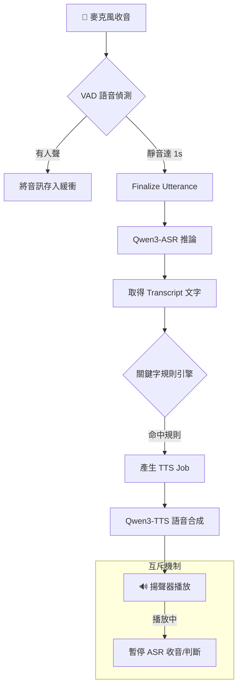

# 🎙️ 語音互動助理 (Voice-Activated Assistant)

這是一個基於 Python 開發的高效能、隱私優先的本地端語音代理系統。透過整合最新的 Qwen3 ASR 與 TTS 技術，實現流暢的語音指令識別與自動化回應。

---

## ✨ 核心特性

- **🚀 極速本地推論**：使用 Qwen3-ASR 與 Qwen3-TTS，支援串流輸出，具備極低首包延遲。
- **🤫 隱私與安全**：語音轉文字 (ASR) 結果僅暫存於記憶體 (RAM)，程式結束後自動釋放，不留任何磁碟紀錄。
- **🧠 智慧停頓偵測 (VAD)**：內建 1.0 秒連續靜音判斷，精準識別一段話的結束點。
- **🚦 狀態機協調**：當 TTS 播放時自動暫停 ASR 監聽，完美解決「自己聽到自己講話」的自我回饋問題。
- **🛠️ JSON 驅動規則**：透過簡單的 JSON 設定檔定義關鍵字、優先序與多樣化的回覆模式。

---

## 🏗️ 技術架構

系統採用多執行緒非同步設計，確保音訊採集與 AI 推論互不干擾：

> 📦 **預覽須知**：本圖使用 Mermaid 語法繪製。若在 VS Code 中看不到圖示，
> 請安裝擴充套件 [Markdown Preview Mermaid Support](https://marketplace.visualstudio.com/items?itemName=bierner.markdown-mermaid)
> （搜尋 `bierner.markdown-mermaid`）後，重新開啟 Markdown Preview 即可正常顯示。

---

## 🛠️ 技術棧

- **語言**: Python 3.10+
- **ASR**: Qwen3-ASR (1.7B)
- **TTS**: Qwen3-TTS
- **VAD**: Silero VAD
- **併發**: Threading + Python Queue

---

## � 開發進度與計畫

專案採階段性開發，目前已完成核心架構的設計與初步實作。詳細的任務追蹤請參閱：

- [📝 專案待辦事項 (TODO.md)](TODO.md)：包含各階段 (Phase 1-8) 的詳細實作清單與驗收標準。
- [📄 產品需求文件 (PRD.md)](PRD.md)：系統架構與演算法細節的權威定義。

---

## �🚀 快速開始 (待補)

目前專案處於開發階段，詳細安裝步驟將在主程式完備後提供。

---

<!-- [😸WSL] -->
<!-- [😸SAM] -->
